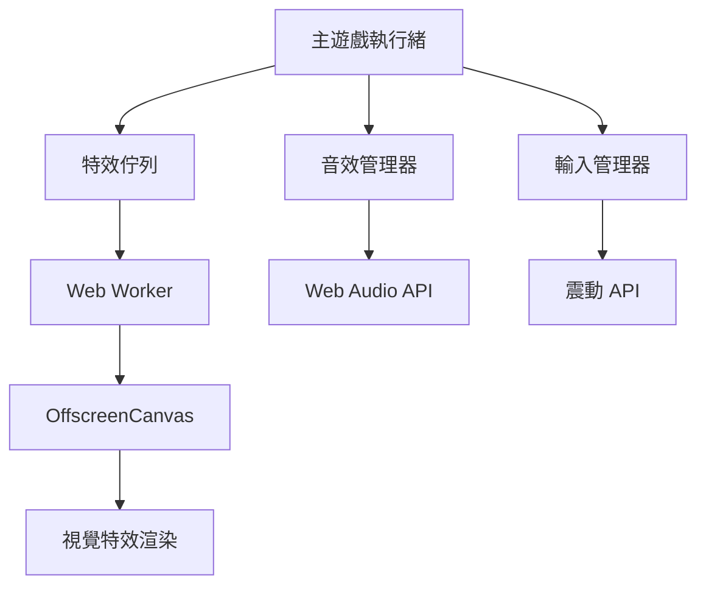

# 音效與特效功能修復設計文檔

## 概述

本文檔描述了修復 ClickFun 遊戲中音效、點擊特效、震動回饋、水波紋和雷電效果功能的技術設計。通過分析原
始版本（提交 3261390）和當前版本的差異，確定需要修復的具體功能。

## 架構

### 系統組件



### 核心類別

1. **AdvancedAudioManager**: 音效系統管理
2. **AdvancedInputManager**: 輸入處理和特效觸發
3. **FX Worker**: 背景特效渲染
4. **GameState**: 遊戲狀態和設定管理

## 組件和介面

### 音效管理器 (AdvancedAudioManager)

```javascript
class AdvancedAudioManager {
  constructor() {
    this.audioContext = null;
    this.masterGain = null;
    this.sounds = {};
    this.isInitialized = false;
  }

  async init() {
    // 初始化 Web Audio Context
    // 創建音效緩衝區
    // 設定主音量控制
  }

  play(soundName, volume = 1) {
    // 播放指定音效
    // 支援音量控制
    // 錯誤處理
  }

  vibrate(duration = 40) {
    // 觸發設備震動
    // 檢查設定和支援性
  }
}
```

### 特效工作器 (fx.worker.js)

```javascript
// 主要功能
const config = {
  rippleEnabled: true,
  lightningEnabled: true
};

// 特效類型
const effects = {
  lightning: [], // 雷電效果
  ripples: [], // 水波紋效果
  trails: {}, // 軌跡效果
  labels: [] // 文字標籤
};

// 渲染函數
function drawLightning() {
  /* 雷電渲染邏輯 */
}
function drawRipples() {
  /* 水波紋渲染邏輯 */
}
function drawTrails() {
  /* 軌跡渲染邏輯 */
}
```

### 輸入管理器整合

```javascript
class AdvancedInputManager {
  onDown(event) {
    // 處理點擊事件
    // 計算 TPS
    // 觸發音效
    // 觸發震動
    // 發送特效數據到 Worker
  }
}
```

## 數據模型

### 遊戲設定

```javascript
const GameState = {
  settings: {
    soundEnabled: true, // 音效開關
    vibrationEnabled: true, // 震動開關
    rippleEnabled: true, // 水波紋開關
    lightningEnabled: true, // 雷電效果開關
    gameDuration: 30, // 遊戲時長
    showTps: true // TPS 顯示開關
  }
};
```

### 特效數據結構

```javascript
// 點擊事件數據
const tapData = {
  x: number, // 點擊 X 座標
  y: number, // 點擊 Y 座標
  ts: number, // 時間戳
  tier: number, // 強度等級 (1-10)
  playerId: string, // 玩家 ID
  mode: string, // 遊戲模式
  rippleEligible: boolean, // 是否觸發水波紋
  ultraSpeed: boolean // 是否超高速模式
};

// 雷電效果配置
const TIER = {
  1: { color: '#ffe6f3', widthMul: 1.0, glow: 0.12 },
  2: { color: '#ffd9ef', widthMul: 1.04, glow: 0.14 },
  // ... 10 個等級
  10: { color: '#52b7ff', widthMul: 1.5, glow: 0.35 }
};
```

## 錯誤處理

### 音效系統錯誤處理

```javascript
class AdvancedAudioManager {
  async init() {
    try {
      // 音效初始化邏輯
    } catch (error) {
      console.warn('Audio initialization failed:', error);
      this.isInitialized = false;
      // 優雅降級，遊戲繼續運行
    }
  }

  play(soundName, volume) {
    if (!this.isInitialized || !GameState.settings.soundEnabled) {
      return; // 靜默失敗
    }

    try {
      // 播放音效
    } catch (error) {
      console.warn(`Failed to play sound ${soundName}:`, error);
    }
  }
}
```

### Web Worker 錯誤處理

```javascript
function setupWorker() {
  try {
    if (typeof OffscreenCanvas !== 'undefined') {
      // 使用 OffscreenCanvas
      offscreen = fxCanvas.transferControlToOffscreen();
      fxWorker = new Worker('./fx.worker.js', { type: 'module' });
    } else {
      // 降級到主執行緒渲染
      fxWorker = new Worker('./fx.worker.js', { type: 'module' });
      fxWorker.postMessage({ type: 'init-fallback' });
    }
  } catch (error) {
    console.error('Worker setup failed:', error);
    // 完全降級到無特效模式
  }
}
```

## 測試策略

### 單元測試

1. **音效管理器測試**
   - 初始化測試
   - 音效播放測試
   - 震動功能測試
   - 設定切換測試

2. **特效系統測試**
   - Worker 初始化測試
   - 特效數據傳輸測試
   - 渲染效能測試

3. **設定管理測試**
   - 設定保存/載入測試
   - 設定同步測試

### 整合測試

1. **點擊到特效流程測試**
   - 點擊事件 → 音效播放
   - 點擊事件 → 震動觸發
   - 點擊事件 → 特效渲染

2. **設定變更測試**
   - 設定變更 → 即時生效
   - 設定變更 → 持久化保存

### 效能測試

1. **音效延遲測試**
   - 點擊到音效播放延遲 < 50ms
   - 多個音效同時播放測試

2. **特效渲染效能測試**
   - 60fps 維持測試
   - 記憶體使用測試
   - CPU 使用測試

## 實作計劃

### 階段 1: 診斷和修復音效系統

- 檢查 AdvancedAudioManager 初始化
- 驗證音效檔案生成
- 測試音效播放功能
- 修復震動功能

### 階段 2: 修復特效系統

- 檢查 fx.worker.js 載入
- 驗證 OffscreenCanvas 支援
- 測試特效數據傳輸
- 修復雷電和水波紋渲染

### 階段 3: 設定系統整合

- 檢查設定 UI 綁定
- 驗證設定保存/載入
- 測試設定即時生效

### 階段 4: 測試和優化

- 執行完整測試套件
- 效能優化
- 跨瀏覽器相容性測試

## 相容性考量

### 瀏覽器支援

- **Web Audio API**: Chrome 36+, Firefox 25+, Safari 14+
- **OffscreenCanvas**: Chrome 69+, Firefox 105+
- **Web Workers**: 所有現代瀏覽器
- **Vibration API**: Chrome 32+, Firefox 16+ (僅 Android)

### 降級策略

1. **音效系統**: Web Audio API → 無音效
2. **特效渲染**: OffscreenCanvas → 主執行緒 Canvas → 無特效
3. **震動功能**: Vibration API → 無震動

## 安全性考量

1. **Web Worker 安全性**
   - 使用相同來源的 Worker 檔案
   - 驗證傳入 Worker 的數據

2. **音效系統安全性**
   - 限制音效播放頻率
   - 防止音效緩衝區溢出

3. **使用者體驗**
   - 遵循瀏覽器自動播放政策
   - 提供音效和震動的關閉選項
