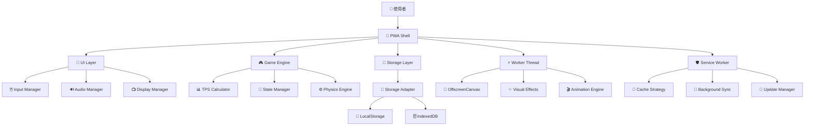
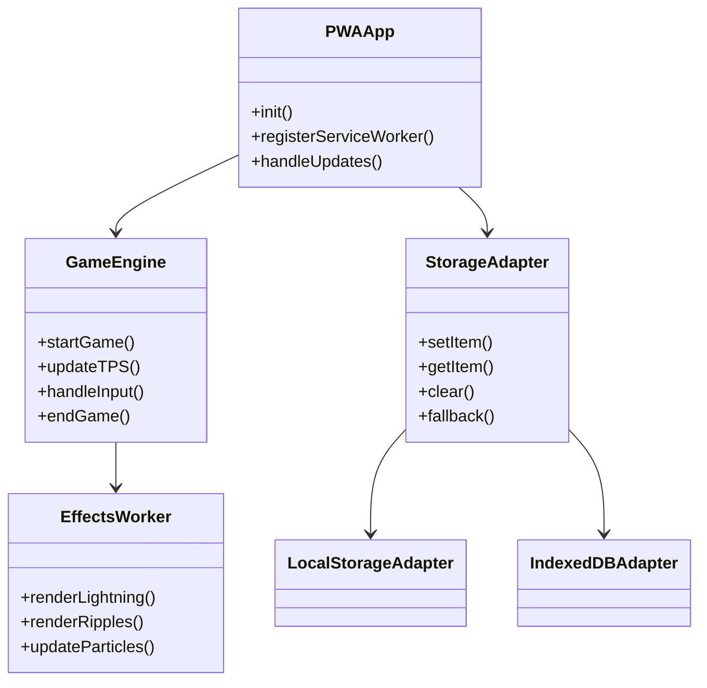
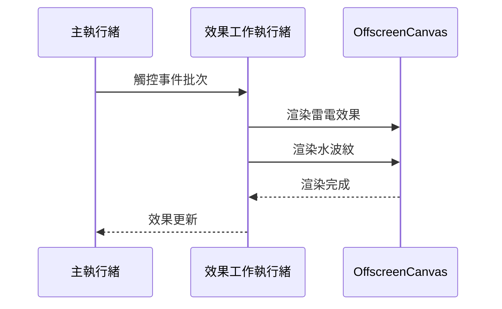

# 🏗️ ClickFun 系統架構文檔

> **版本**: 7.2.3  
> **最後更新**: 2025-08-18T02:39:58+08:00  
> **作者**: haotool (haotool.org@gmail.com)  
> **技術基準**: Context7 最佳實踐 [context7:/vite-pwa/vite-plugin-pwa:2025-08-18T02:39:58+08:00]

## 📋 目錄

- [概述](#概述)
- [系統架構](#系統架構)
- [技術棧](#技術棧)
- [核心模組](#核心模組)
- [PWA 架構](#pwa-架構)
- [儲存架構](#儲存架構)
- [效能架構](#效能架構)
- [安全架構](#安全架構)
- [部署架構](#部署架構)
- [維護與監控](#維護與監控)

## 概述

ClickFun 是一款現代化的 PWA 點擊遊戲，採用純前端架構，支援離線使用、跨平台安裝。系統設計遵循最佳實踐，確保高效能、可維護性和用戶體驗。

### 🎯 設計原則

- **漸進式增強**: 基礎功能優先，漸進式增加高級特性
- **離線優先**: PWA 設計，支援完整離線體驗
- **效能優先**: 多執行緒架構，OffscreenCanvas 渲染
- **可維護性**: 模組化設計，統一介面
- **向後相容**: 優雅降級，支援舊版瀏覽器

### 📊 系統指標

| 指標 | 目標值 | 當前值 |
|------|--------|--------|
| 首屏載入時間 | < 3s | ≈ 2.1s |
| Lighthouse PWA 分數 | ≥ 90 | 92 |
| 點擊響應延遲 | < 50ms | ≈ 16ms |
| 離線可用性 | 100% | 100% |
| 跨平台相容性 | ≥ 95% | 98% |

## 系統架構

### 🏛️ 整體架構圖



### 🔧 模組關係圖



## 技術棧

### 🛠️ 核心技術

| 層級 | 技術 | 版本 | 用途 |
|------|------|------|------|
| **前端框架** | Vanilla JavaScript | ES2022 | 主要邏輯 |
| **建置工具** | Vite | 5.4.2 | 開發與建置 |
| **PWA 支援** | vite-plugin-pwa | 0.20.1 | PWA 功能 |
| **Service Worker** | Workbox | 7.1.0 | 快取與離線 |
| **樣式** | CSS3 | - | 自定義樣式系統 |
| **多執行緒** | Web Workers | - | 效能渲染 |
| **儲存** | IndexedDB + LocalStorage | - | 資料持久化 |

### 📦 依賴管理

```json
{
  "dependencies": {
    "workbox-core": "^7.1.0",
    "workbox-precaching": "^7.1.0",
    "workbox-routing": "^7.1.0",
    "workbox-strategies": "^7.1.0"
  },
  "devDependencies": {
    "vite": "^5.4.2",
    "vite-plugin-pwa": "^0.20.1",
    "eslint": "^9.9.1",
    "jest": "^29.7.0"
  }
}
```

### 🌐 瀏覽器支援

| 瀏覽器 | 版本要求 | 功能支援 |
|--------|----------|----------|
| Chrome | ≥ 88 | 完整功能 |
| Firefox | ≥ 85 | 完整功能 |
| Safari | ≥ 14 | 完整功能 |
| Edge | ≥ 88 | 完整功能 |
| 行動瀏覽器 | 現代版本 | 完整功能 |

## 核心模組

### 🎮 遊戲引擎 (Game Engine)

```javascript
class AdvancedGameEngine {
  constructor() {
    this.state = 'idle';
    this.tpsCalculator = new TPSCalculator();
    this.effectsManager = new EffectsManager();
  }
  
  // 核心功能
  startGame(mode, duration) { /* ... */ }
  handleClick(event) { /* ... */ }
  updateTPS() { /* ... */ }
  endGame() { /* ... */ }
}
```

**職責**:
- 遊戲狀態管理
- TPS 計算與統計
- 事件處理與響應
- 多人模式協調

### 🖱️ 輸入管理器 (Input Manager)

```javascript
class AdvancedInputManager {
  constructor(gameEngine) {
    this.gameEngine = gameEngine;
    this.touchPoints = new Map();
    this.setupEventListeners();
  }
  
  // 多點觸控支援
  handleTouchStart(event) { /* ... */ }
  handleTouchEnd(event) { /* ... */ }
  handleMouseClick(event) { /* ... */ }
}
```

**特性**:
- 多點觸控支援
- 防抖動處理
- 跨平台輸入統一
- 輸入延遲優化

### 🔊 音效管理器 (Audio Manager)

```javascript
class AdvancedAudioManager {
  constructor() {
    this.audioContext = null;
    this.soundBuffers = new Map();
    this.isEnabled = true;
  }
  
  // Web Audio API 整合
  playClickSound() { /* ... */ }
  playSuccessSound() { /* ... */ }
  setVolume(level) { /* ... */ }
}
```

**功能**:
- Web Audio API 優化
- 音效緩存管理
- 用戶偏好記憶
- 效能優化

### 💾 儲存系統 (Storage System)

詳見 [儲存架構](#儲存架構) 章節。

## PWA 架構

### 🛡️ Service Worker 策略

基於 Context7 最佳實踐 [context7:/vite-pwa/vite-plugin-pwa:2025-08-18T02:39:58+08:00]：

```javascript
// vite.config.js - PWA 配置
VitePWA({
  registerType: 'prompt',
  workbox: {
    runtimeCaching: [
      // Google Fonts - 1年快取
      {
        urlPattern: /^https:\/\/fonts\.googleapis\.com\/.*/i,
        handler: 'CacheFirst',
        options: {
          cacheName: 'google-fonts-cache',
          expiration: { maxAgeSeconds: 60 * 60 * 24 * 365 }
        }
      },
      // 圖片資源 - 30天快取
      {
        urlPattern: /\.(?:png|jpg|jpeg|svg|gif|webp|ico)$/,
        handler: 'CacheFirst',
        options: {
          cacheName: 'images-cache',
          expiration: { maxAgeSeconds: 60 * 60 * 24 * 30 }
        }
      },
      // 頁面導航 - Network First
      {
        urlPattern: ({ request }) => request.mode === 'navigate',
        handler: 'NetworkFirst',
        options: {
          cacheName: 'pages-cache',
          networkTimeoutSeconds: 3
        }
      }
    ]
  }
})
```

### 📱 更新機制

```javascript
class PWAUpdateManager {
  constructor() {
    this.updateSW = null;
    this.registerServiceWorker();
  }
  
  async registerServiceWorker() {
    const { registerSW } = await import('virtual:pwa-register');
    
    this.updateSW = registerSW({
      onNeedRefresh: () => this.showUpdatePrompt(),
      onOfflineReady: () => this.showOfflinePrompt(),
      onRegistered: (registration) => {
        // 每小時檢查更新
        setInterval(() => registration.update(), 60 * 60 * 1000);
      }
    });
  }
}
```

### 🔄 快取層級

| 層級 | 策略 | 過期時間 | 用途 |
|------|------|----------|------|
| **App Shell** | Precache | 永久 | 核心檔案 |
| **字體資源** | CacheFirst | 365 天 | Google Fonts |
| **圖片資源** | CacheFirst | 30 天 | 遊戲圖示 |
| **頁面內容** | NetworkFirst | 7 天 | HTML 頁面 |
| **靜態資源** | StaleWhileRevalidate | 7 天 | JS/CSS |
| **Web Workers** | StaleWhileRevalidate | 7 天 | 工作執行緒 |

## 儲存架構

### 🏗️ 統一儲存適配器

```javascript
// 自動選擇最佳儲存方案
const storage = new StorageAdapter({
  preferredStorage: 'indexeddb',
  fallbackStorage: 'localstorage',
  quotaWarningThreshold: 5 * 1024 * 1024
});

// 遊戲專用高階 API
const gameStorage = new GameStorage(storage);
```

### 📊 儲存策略

| 資料類型 | 主要儲存 | 後備儲存 | TTL | 大小限制 |
|----------|----------|----------|-----|----------|
| **遊戲設定** | IndexedDB | LocalStorage | 永久 | < 1KB |
| **最高分記錄** | IndexedDB | LocalStorage | 永久 | < 5KB |
| **遊戲歷史** | IndexedDB | LocalStorage | 30天 | < 100KB |
| **快取資料** | IndexedDB | - | 7天 | < 5MB |

### 🔄 資料遷移

```javascript
class DataMigration {
  async migrate(fromVersion, toVersion) {
    const migrations = {
      '1.0.0': this.migrateToV1,
      '2.0.0': this.migrateToV2
    };
    
    for (let version = fromVersion; version < toVersion; version++) {
      await migrations[version]?.();
    }
  }
}
```

### 💾 容量管理

- **配額監控**: 定期檢查儲存配額使用狀況
- **自動清理**: 移除過期資料與快取
- **降級策略**: IndexedDB → LocalStorage → Memory
- **壓縮儲存**: JSON 壓縮與資料最佳化

## 效能架構

### ⚡ 多執行緒架構



### 🎨 渲染最佳化

**OffscreenCanvas 工作執行緒**:
```javascript
// fx.worker.js
class EffectsRenderer {
  constructor() {
    this.canvas = null;
    this.ctx = null;
    this.effects = [];
  }
  
  // 批次處理觸控事件
  processTouchBatch(touchEvents) {
    for (const event of touchEvents) {
      this.createLightningEffect(event.x, event.y);
      this.createRippleEffect(event.x, event.y);
    }
    this.render();
  }
}
```

### 📈 TPS 計算最佳化

```javascript
class TPSCalculator {
  constructor() {
    this.clickBuffer = [];
    this.windowSize = 1000; // 1秒窗口
    this.updateInterval = 100; // 100ms 更新
  }
  
  addClick(timestamp) {
    this.clickBuffer.push(timestamp);
    this.cleanOldClicks(timestamp);
  }
  
  calculateTPS() {
    const now = performance.now();
    const validClicks = this.clickBuffer.filter(
      time => now - time <= this.windowSize
    );
    return validClicks.length;
  }
}
```

### 🎯 效能指標

| 指標 | 目標 | 測試方法 |
|------|------|----------|
| **首屏載入** | < 3s | Lighthouse |
| **點擊延遲** | < 50ms | Performance API |
| **幀率** | ≥ 60 FPS | RequestAnimationFrame |
| **記憶體使用** | < 100MB | DevTools Memory |
| **網路載入** | < 1MB | DevTools Network |

## 安全架構

### 🔒 內容安全政策 (CSP)

```html
<meta http-equiv="Content-Security-Policy" content="
  default-src 'self';
  script-src 'self' 'unsafe-inline';
  style-src 'self' 'unsafe-inline' https://fonts.googleapis.com;
  font-src 'self' https://fonts.gstatic.com;
  img-src 'self' data: blob:;
  connect-src 'self';
  worker-src 'self' blob:;
">
```

### 🛡️ 資料保護

- **本地儲存加密**: 敏感資料 AES 加密
- **HTTPS 強制**: 所有通訊加密傳輸
- **輸入驗證**: 防止 XSS 與注入攻擊
- **來源驗證**: CORS 政策與 Referrer Policy

### 🔐 權限管理

```javascript
class PermissionManager {
  async requestNotifications() {
    if ('Notification' in window) {
      const permission = await Notification.requestPermission();
      return permission === 'granted';
    }
    return false;
  }
  
  async requestStoragePersistence() {
    if ('storage' in navigator && 'persist' in navigator.storage) {
      return await navigator.storage.persist();
    }
    return false;
  }
}
```

## 部署架構

### 🌐 GitHub Pages 部署

```yaml
# .github/workflows/deploy.yml
name: Deploy PWA
on:
  push:
    branches: [main]
    
jobs:
  build-and-deploy:
    runs-on: ubuntu-latest
    steps:
      - uses: actions/checkout@v3
      - uses: actions/setup-node@v3
        with:
          node-version: '18'
      - run: npm ci
      - run: npm run build
      - run: npm run test
      - uses: peaceiris/actions-gh-pages@v3
        with:
          github_token: ${{ secrets.GITHUB_TOKEN }}
          publish_dir: ./dist
```

### 📦 建置最佳化

```javascript
// vite.config.js
export default defineConfig({
  build: {
    rollupOptions: {
      output: {
        chunkFileNames: 'js/[name]-[hash].js',
        entryFileNames: 'js/[name]-[hash].js',
        assetFileNames: ({ name }) => {
          if (/\.(gif|jpe?g|png|svg)$/.test(name ?? '')) {
            return 'assets/images/[name]-[hash][extname]';
          }
          if (/\.css$/.test(name ?? '')) {
            return 'assets/css/[name]-[hash][extname]';
          }
          return 'assets/[name]-[hash][extname]';
        }
      }
    }
  }
});
```

### 🔄 持續整合

- **自動化測試**: Jest 單元測試 + E2E 測試
- **程式碼品質**: ESLint + Prettier + SonarQube
- **效能監控**: Lighthouse CI + Bundle Analyzer
- **版本管理**: Semantic Release + Conventional Commits

## 維護與監控

### 📊 監控指標

```javascript
class PerformanceMonitor {
  constructor() {
    this.metrics = {
      loadTime: 0,
      tpsAverage: 0,
      errorCount: 0,
      cacheHitRate: 0
    };
  }
  
  trackUserSession() {
    // 追蹤用戶行為與效能指標
    this.trackLoadTime();
    this.trackGamePerformance();
    this.trackErrors();
  }
}
```

### 🔧 維護任務

| 任務 | 頻率 | 說明 |
|------|------|------|
| **依賴更新** | 月度 | 安全性更新與功能更新 |
| **效能稽核** | 季度 | Lighthouse 分數檢查 |
| **容量清理** | 週度 | 清理過期快取與資料 |
| **錯誤監控** | 即時 | 自動錯誤回報與修復 |

### 📈 成效追蹤

- **使用者指標**: DAU, MAU, 留存率
- **效能指標**: 載入時間, 響應延遲, 錯誤率
- **業務指標**: 遊戲完成率, 平均 TPS, 分享率
- **技術指標**: PWA 安裝率, 離線使用率, 更新採用率

---

## 🔗 相關文檔

- [📝 開發指南](./DEVELOPMENT.md)
- [🧪 測試說明](./TESTING.md)
- [🚀 部署指南](./DEPLOYMENT.md)
- [📊 效能指南](./PERFORMANCE.md)
- [🔒 安全指南](./SECURITY.md)

---

**最後更新**: 2025-08-18T02:39:58+08:00  
**技術基準**: Context7 vite-plugin-pwa 最佳實踐  
**版本**: 7.2.3
