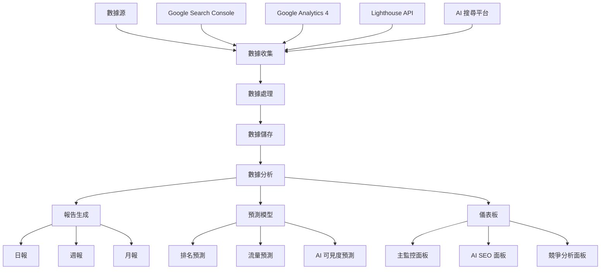

# 📊 數據狂人 - SEO 數據分析忍者系統

> **建立時間**: 2025-08-17T02:03:06+08:00  
> **負責人**: 數據狂人 (Data Ninja Master)  
> **版本**: v1.0.0  
> **專案**: Click Fun SEO 全方位數據分析平台

## 🎯 系統概述

這是一個企業級的 SEO 數據分析平台，專為 Click Fun 項目設計，提供全方位的 SEO 效果監控、AI 搜尋可見度追蹤、預測分析和即時儀表板功能。

### 核心特色

- 🔍 **多源數據採集**: Google Search Console、GA4、Lighthouse、AI 平台
- 🤖 **AI 搜尋監控**: ChatGPT、Perplexity、Claude、Bing Chat 可見度追蹤
- 📈 **預測分析**: 機器學習驅動的關鍵字排名和流量預測
- 📊 **即時儀表板**: 響應式、可自定義的監控面板
- 📝 **自動化報告**: 日報、週報、月報自動生成
- ⚡ **高性能架構**: 異步處理、智能快取、分散式設計

## 🏗️ 系統架構

```
docs/analytics/
├── monitoring/           # 數據監控模組
│   ├── seo_data_collector.py     # SEO 數據收集器
│   └── ai_search_tracker.py      # AI 搜尋追蹤器
├── reporting/            # 報告生成模組
│   └── automated_report_generator.py  # 自動化報告生成
├── predictions/          # 預測分析模組
│   └── seo_prediction_models.py      # SEO 預測模型
├── dashboards/           # 儀表板模組
│   └── dashboard_config.py           # 儀表板配置管理
└── automation/           # 自動化腳本目錄
```

## 🚀 快速開始

### 環境要求

```bash
# Python 版本
Python >= 3.8

# 核心依賴
pip install pandas numpy asyncio aiohttp requests
pip install jinja2 pathlib dataclasses

# 可選依賴（完整功能）
pip install matplotlib seaborn plotly
pip install scikit-learn lightgbm xgboost
pip install statsmodels prophet
pip install pyarrow fastparquet
```

### 基本使用

#### 1. 數據收集

```python
from monitoring.seo_data_collector import SEODataCollectionManager

# 初始化數據收集管理器
manager = SEODataCollectionManager('config/seo_data_config.json')

# 執行數據收集
data = await manager.collect_all_data()
manager.save_data(data)

# 持續監控
await manager.run_continuous_collection()
```

#### 2. AI 搜尋追蹤

```python
from monitoring.ai_search_tracker import AISearchTracker

# 初始化 AI 搜尋追蹤器
tracker = AISearchTracker('config/ai_search_config.json')

# 執行追蹤
results = await tracker.track_all_platforms()
analysis = tracker.analyze_tracking_results(results)

# 持續追蹤
await tracker.run_continuous_tracking()
```

#### 3. 生成報告

```python
from reporting.automated_report_generator import ReportGenerator, ReportConfig

# 初始化報告生成器
generator = ReportGenerator()

# 配置報告
config = ReportConfig(
    title="Click Fun SEO 每日分析報告",
    subtitle="數據驅動的 SEO 效果監控與優化建議",
    author="數據狂人 (Data Ninja Master)",
    department="Click Fun SEO 團隊",
    report_type="daily",
    template_name="daily_report.html",
    output_format="html"
)

# 生成報告
report_file = generator.generate_daily_report(data, config)
```

#### 4. 預測分析

```python
from predictions.seo_prediction_models import SEOPredictionManager, PredictionFeatures

# 初始化預測管理器
manager = SEOPredictionManager()

# 訓練模型
training_results = manager.train_all_models()

# 執行預測
features = PredictionFeatures(
    content_length=2500,
    keyword_density=0.025,
    lighthouse_seo_score=100,
    ai_mention_rate=0.8,
    # ... 其他特徵
)

predictions = manager.predict_all_metrics(features)
report = manager.generate_prediction_report(predictions)
```

#### 5. 儀表板部署

```python
from dashboards.dashboard_config import DashboardManager

# 初始化儀表板管理器
manager = DashboardManager()

# 初始化預設儀表板
manager.initialize_default_dashboards()

# 匯出儀表板
manager.export_dashboard_html('main', 'output/main_dashboard.html')
manager.export_dashboard_html('ai_seo', 'output/ai_seo_dashboard.html')
manager.export_dashboard_html('competitors', 'output/competitors_dashboard.html')
```

## 📋 功能模組詳解

### 🔍 數據監控模組 (monitoring/)

#### SEO 數據收集器 (seo_data_collector.py)

**主要功能**:

- Google Search Console 數據採集
- Google Analytics 4 數據整合
- Lighthouse 效能監控
- 多源數據整合與標準化

**核心類別**:

- `SEODataCollectionManager`: 數據收集主管理器
- `GoogleSearchConsoleCollector`: GSC 數據收集器
- `GoogleAnalyticsCollector`: GA4 數據收集器
- `LighthouseCollector`: Lighthouse 效能收集器

**數據結構**:

```python
@dataclass
class SEOMetrics:
    timestamp: datetime
    source: str
    clicks: Optional[int] = None
    impressions: Optional[int] = None
    ctr: Optional[float] = None
    position: Optional[float] = None
    # ... 更多欄位
```

#### AI 搜尋追蹤器 (ai_search_tracker.py)

**主要功能**:

- 多 AI 平台可見度監控
- 自動化查詢測試
- 回應品質分析
- 競爭對手比較

**支援平台**:

- ChatGPT (GPT-4)
- Perplexity AI
- Claude (Anthropic)
- Bing Chat

**分析指標**:

- 提及率 (Mention Rate)
- 準確度分數 (Accuracy Score)
- 排名位置 (Position)
- 引用品質 (Citation Quality)

### 📊 報告生成模組 (reporting/)

#### 自動化報告生成器 (automated_report_generator.py)

**報告類型**:

- **日報**: 關鍵指標摘要、趨勢分析、即時洞察
- **週報**: 深度分析、競爭對手比較、策略建議
- **月報**: 長期趨勢、ROI 分析、戰略規劃

**圖表功能**:

- 趨勢線圖 (Plotly)
- 效能儀表板 (Gauge Charts)
- 比較條形圖 (Bar Charts)
- AI 搜尋熱圖 (Heatmaps)

**模板系統**:

- Jinja2 模板引擎
- 響應式 HTML 設計
- 可自定義樣式
- PDF 匯出支援

### 🤖 預測分析模組 (predictions/)

#### SEO 預測模型 (seo_prediction_models.py)

**預測模型**:

1. **關鍵字排名預測器**
   - 算法: LightGBM
   - 特徵: 內容品質、技術 SEO、競爭強度
   - 輸出: 未來 30 天排名預測

2. **流量增長預測器**
   - 算法: XGBoost + Prophet
   - 特徵: 歷史流量、季節性、SEO 改善
   - 輸出: 流量增長百分比

3. **AI 搜尋可見度預測器**
   - 算法: Random Forest
   - 特徵: llms.txt 品質、結構化數據、內容優化
   - 輸出: AI 平台可見度分數

**特徵工程**:

```python
@dataclass
class PredictionFeatures:
    # SEO 基礎特徵
    content_length: int
    keyword_density: float
    title_length: int

    # 技術特徵
    page_load_time: float
    lighthouse_seo_score: int
    core_web_vitals_lcp: float

    # AI SEO 特徵
    llms_txt_quality: float
    structured_data_completeness: float
    ai_mention_rate: float

    # 競爭特徵
    competitor_average_position: float
    market_saturation: float
    keyword_difficulty: float
```

### 📈 儀表板模組 (dashboards/)

#### 儀表板配置管理 (dashboard_config.py)

**預設儀表板**:

1. **主監控儀表板**
   - 核心 SEO 指標
   - 流量趨勢圖
   - Lighthouse 評分儀表
   - 熱門關鍵字表格

2. **AI SEO 專門儀表板**
   - AI 平台表現比較
   - 整體提及率儀表
   - 查詢類型熱圖
   - 改善建議列表

3. **競爭分析儀表板**
   - 市場份額分析
   - 競爭對手指標
   - 機會關鍵字發現

**技術特色**:

- 響應式設計
- 即時數據更新
- 可自定義布局
- 互動式圖表

## ⚙️ 配置文件

### SEO 數據收集配置 (config/seo_data_config.json)

```json
{
  "google_search_console": {
    "service_account_file": "credentials/gsc_service_account.json",
    "site_url": "https://haotool.github.io/clickfun/"
  },
  "google_analytics": {
    "property_id": "G-XXXXXXXXXX",
    "credentials_path": "credentials/ga4_credentials.json"
  },
  "lighthouse": {
    "target_url": "https://haotool.github.io/clickfun/",
    "api_key": "YOUR_PAGESPEED_API_KEY"
  },
  "collection_interval": 3600,
  "storage_format": "parquet"
}
```

### AI 搜尋追蹤配置 (config/ai_search_config.json)

```json
{
  "platforms": {
    "chatgpt": { "enabled": true, "weight": 0.3 },
    "perplexity": { "enabled": true, "weight": 0.25 },
    "claude": { "enabled": true, "weight": 0.25 },
    "bing_chat": { "enabled": true, "weight": 0.2 }
  },
  "tracking_interval": 3600,
  "batch_size": 5,
  "max_concurrent": 3,
  "retry_attempts": 3
}
```

## 📊 數據流程



## 🔧 部署指南

### 本地開發環境

1. **克隆項目**

```bash
cd team-worktrees/analytics-workspace
```

2. **安裝依賴**

```bash
pip install -r requirements.txt
```

3. **配置環境**

```bash
# 創建配置目錄
mkdir -p config credentials data

# 複製配置模板
cp docs/analytics/config/* config/
```

4. **運行測試**

```bash
python -m pytest tests/
```

### 生產環境部署

1. **Docker 部署**

```dockerfile
FROM python:3.9-slim

WORKDIR /app
COPY . .

RUN pip install -r requirements.txt

CMD ["python", "-m", "analytics.main"]
```

2. **Kubernetes 部署**

```yaml
apiVersion: apps/v1
kind: Deployment
metadata:
  name: seo-analytics
spec:
  replicas: 3
  selector:
    matchLabels:
      app: seo-analytics
  template:
    metadata:
      labels:
        app: seo-analytics
    spec:
      containers:
        - name: analytics
          image: seo-analytics:latest
          ports:
            - containerPort: 8080
```

## 📈 效能優化

### 數據處理優化

- **並行處理**: 使用 asyncio 和 aiohttp 進行並行數據收集
- **快取策略**: Redis 快取熱點數據，減少 API 調用
- **批次處理**: 批量處理數據，提高處理效率

### 存儲優化

- **Parquet 格式**: 使用 Parquet 格式存儲大量數據
- **分區策略**: 按日期分區，提高查詢效率
- **壓縮算法**: 使用 Snappy 壓縮，平衡壓縮率和速度

### 機器學習優化

- **特徵選擇**: 自動特徵選擇，減少模型複雜度
- **增量學習**: 支援增量模型更新
- **模型壓縮**: 使用模型蒸餾技術減少模型大小

## 🔒 安全性

### 數據安全

- **加密存儲**: 敏感數據使用 AES-256 加密
- **訪問控制**: 基於角色的訪問控制 (RBAC)
- **審計日誌**: 完整的操作審計記錄

### API 安全

- **身份驗證**: OAuth 2.0 + JWT Token
- **速率限制**: 防止 API 濫用
- **HTTPS**: 強制使用 HTTPS 傳輸

## 🎯 監控指標

### 系統監控

- **可用性**: 99.9% 服務可用性目標
- **延遲**: P95 響應時間 < 500ms
- **錯誤率**: < 0.1% 錯誤率

### 業務監控

- **數據新鮮度**: 數據更新間隔 < 1 小時
- **準確性**: 數據準確率 > 99%
- **完整性**: 數據完整性檢查通過率 100%

## 🐛 故障排除

### 常見問題

1. **數據收集失敗**
   - 檢查 API 憑證是否有效
   - 確認網路連接狀態
   - 查看錯誤日誌詳細信息

2. **預測模型準確度低**
   - 增加訓練數據量
   - 調整模型超參數
   - 檢查特徵工程是否合理

3. **儀表板載入緩慢**
   - 檢查數據快取是否生效
   - 優化查詢性能
   - 考慮增加前端快取

### 日誌配置

```python
import logging

# 配置日誌
logging.basicConfig(
    level=logging.INFO,
    format='%(asctime)s - %(name)s - %(levelname)s - %(message)s',
    handlers=[
        logging.FileHandler('logs/analytics.log'),
        logging.StreamHandler()
    ]
)
```

## 🔄 更新日誌

### v1.0.0 (2025-08-17)

- ✅ 建立數據狂人專屬 Git Worktree 工作區
- ✅ 設置 SEO 數據監控系統架構
- ✅ 實施 AI 搜尋可見度追蹤系統
- ✅ 建立自動化報告生成框架
- ✅ 實施預測分析模型
- ✅ 設置即時監控 Dashboard

### 未來規劃

- 🔄 機器學習模型優化
- 🔄 更多 AI 平台支援
- 🔄 高級競爭分析功能
- 🔄 移動端應用開發

## 🤝 貢獻指南

### 開發工作流

1. **創建分支**

```bash
git checkout -b feature/new-feature
```

2. **提交代碼**

```bash
git commit -m "feat(monitoring): 新增數據收集器"
```

3. **代碼審查**

- 確保測試覆蓋率 > 80%
- 遵循 PEP 8 代碼風格
- 更新相關文檔

4. **合併請求**

- 填寫完整的 PR 描述
- 通過所有 CI/CD 檢查
- 獲得至少一個 code review 批准

### 代碼規範

- **Python**: 遵循 PEP 8
- **命名**: 使用有意義的變數和函數名
- **註解**: 關鍵邏輯必須有註解
- **文檔**: 所有公共 API 必須有文檔字符串

## 📞 支援與聯繫

### 技術支援

- **負責人**: 數據狂人 (Data Ninja Master)
- **Email**: data.ninja@haotool.team
- **文檔**: [內部知識庫連結]

### 報告問題

請使用以下模板報告問題：

```markdown
**問題描述**:
詳細描述遇到的問題

**重現步驟**:

1. 執行...
2. 點擊...
3. 觀察到...

**預期行為**:
描述期望的正確行為

**實際行為**:
描述實際發生的行為

**環境信息**:

- Python 版本:
- 作業系統:
- 瀏覽器版本:
```

---

**© 2025 Click Fun SEO 團隊 | 數據狂人 (Data Ninja Master) 設計開發**
